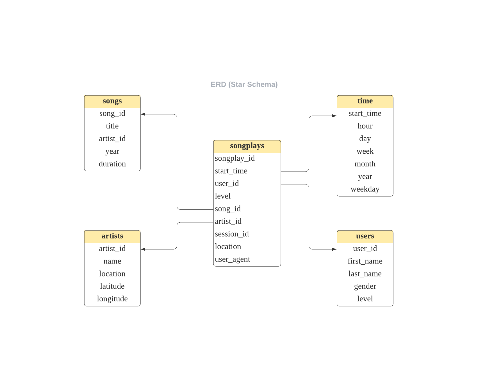

# Project: Data Modeling with Postgres

## Purpose of the Project:

The data modeling of this project is based on the datasets of user activity on a new music streaming app developed by a startup company called Sparkify. The company's analytics team is particularly interested in understanding what songs users are listening to. The purpose to this project is to build an ETL pipeline using Python and SQL to help them query their data easier.

## Dataset

### Song Dataset

This dataset is a subset of real data from the [Million Song Dataset](https://labrosa.ee.columbia.edu/millionsong/). Each file is in JSON format and contains metadata about a song and the artist of that song.

### Log Dataset

This dataset consists of log files in JSON format generated by this [event simulator](https://github.com/Interana/eventsim) based on the songs in the dataset above. 

## Database Schema Design

### Fact Table

**songplays**: This table records in log data associated with song plays.

    songplay
        - songplay_id, 
        - start_time, 
        - user_id, 
        - level
        - song_id
        - artist_id
        - session_id
        - location
        - user_agent

### Dimension Tables

* users - records user information in the app.
  
    user_id, first_name, last_name, gender, level

* songs - records songs in the database.

    user_id, first_name, last_name, gender, level

* artists - records artists in the music database.

    artist_id, name, location, latitude, longitude

* time - timestamps of records in **songplays** broken down into specific units.

    start_time, hour, day, week, month, year, weekday

Each primary key of the dimension tables is related to the fact table, which forms a star schema style. By using this database, analysts could quickly aggregate related tables to query information.

## ETL Pipeline

The ETL pipeline contains three components written by Python.

* sql_queries.py - contains all the sql queries for importing.
* create_tables.py - creates a database and create / drop tables.
* etl.py - processes data from log file and song file and transfer them into Postgres tables.